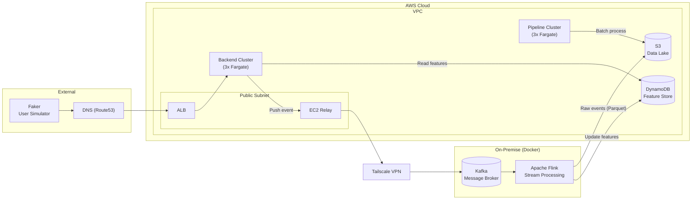

# Streaming Fraud Detection

Real-time credit card transaction fraud detection system. Hybrid architecture: **On-Premise (Docker)** stream processing + **AWS Cloud** serving, storage, analytics. Pattern follows **Uber's fraud detection model**: DynamoDB as real-time feature store, Kafka as async backbone, Flink for stream computation.

## Architecture



### End-to-End Flow

| Step | What Happens |
|------|--------------|
| 1 | Faker sends transaction request via HTTP to ALB |
| 2 | ALB routes to Backend Cluster |
| 3 | Backend reads pre-computed user features from DynamoDB |
| 4 | Backend runs decision engine, responds to client |
| 5 | Backend pushes event to Kafka (after HTTP response, async) |
| 6 | Flink consumes Kafka, computes new fraud features |
| 7 | Flink updates DynamoDB with new features (for next request) |
| 8 | Flink writes raw events to S3 as Parquet |
| 9 | Glue Crawler catalogs S3 data |
| 10 | dbt transforms raw → analytics models |
| 11 | Pipeline Cluster runs batch jobs on S3 data |
| 12 | QuickSight dashboards for fraud analysts |

## Monorepo Structure

```
streaming-fraud-detection/
├── .github/workflows/          # CI/CD pipelines
├── docs/                       # Architecture docs & project plan
├── infra/terraform/            # Infrastructure as Code (AWS)
│   ├── modules/                # Reusable Terraform modules
│   └── environments/           # Dev / Prod environments
│
├── services/                   # AWS Cloud services
│   ├── backend-api/            # FastAPI decision engine
│   ├── pipeline/               # Batch processing jobs
│   └── ml-training/            # ML model training
│
├── faker/                      # External user simulator
│   ├── src/                    # Faker script
│   └── tests/
│
├── data-pipeline/              # On-premise (Docker)
│   ├── flink/                  # Stream processing (SQL + UDF)
│   └── kafka/                  # Message broker config
│
├── analytics/dbt/              # dbt data transformation models
├── docker/                     # Docker Compose orchestration
├── configs/                    # Shared configuration
├── scripts/                    # Utility scripts
├── .env.example
├── .gitignore
└── README.md
```

### Folder Details

| Folder | Description | Runs on |
|--------|-------------|---------|
| `faker/` | Transaction simulator (Python) | Local / any |
| `data-pipeline/kafka/` | Apache Kafka config & init scripts | Docker (on-premise) |
| `data-pipeline/flink/` | Flink SQL job + Python UDFs | Docker (on-premise) |
| `services/backend-api/` | FastAPI REST decision engine | AWS ECS Fargate |
| `services/pipeline/` | Batch ETL jobs (daily report, data quality, fraud pattern) | AWS ECS Fargate |
| `services/ml-training/` | ML feature engineering, training, evaluation | AWS ECS / ad-hoc |
| `analytics/dbt/` | dbt models (staging → facts → aggregates) | GitHub Actions |
| `infra/terraform/` | Terraform modules for all AWS resources | Local / CI |

## Tech Stack

| Layer | Technology |
|-------|-----------|
| Data Generation | Python (Faker) |
| Feature Store | AWS DynamoDB (on-demand) |
| Message Broker | Apache Kafka (Docker) |
| Stream Processing | Apache Flink SQL + Python UDF |
| Data Lake | AWS S3 (Parquet, Snappy) |
| Schema Registry | AWS Glue Catalog |
| Query Engine | AWS Athena |
| Data Transformation | dbt (dbt-athena) |
| API Backend | Python FastAPI (ECS Fargate) |
| Load Balancer | AWS ALB |
| Networking | Tailscale VPN |
| Orchestration | Docker Compose (on-premise), ECS (cloud) |
| CI/CD | GitHub Actions |
| Infrastructure | Terraform |

## Development

### Prerequisites

- Docker & Docker Compose
- Python 3.11+
- AWS CLI (for cloud deployment)
- Terraform (for infrastructure)

### Quick Start

```bash
# 1. Setup environment
cp .env.example .env
# Edit .env with your AWS credentials

# 2. Start on-premise services (Kafka + Flink)
docker compose -f docker/docker-compose.yml up -d

# 3. Run faker simulator
python faker/src/faker.py

# 4. Or run everything locally
docker compose -f docker/docker-compose.local.yml up -d
```

## Project Phases

| Phase | Description | Duration |
|-------|-------------|----------|
| 1 | Foundation Infrastructure (VPC, DynamoDB, S3, Docker) | 4d |
| 2 | Core Data Pipeline (Faker → Kafka → Flink → S3 + DynamoDB) | 5d |
| 3 | Data Lake & Analytics (Glue, Athena, dbt, QuickSight) | 4.5d |
| 4 | Backend Service + DynamoDB Feature Store | 4.5d |
| 5 | Hybrid Networking (Tailscale + EC2 Relay) | 3d |
| 6 | Pipeline Cluster — Batch Processing | 5d |
| 7 | ML Training & Feedback Loop | 6.5d |
| 8 | Monitoring, Scaling & Production | 5d |

See [docs/PROJECT_PLAN.md](docs/PROJECT_PLAN.md) for full implementation plan.
