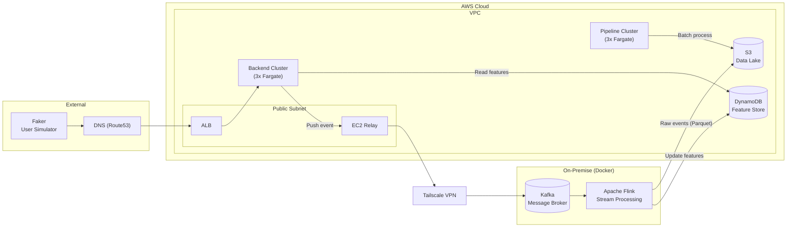

# Streaming Fraud Detection — Architecture Overview

## Overview

Real-time credit card transaction fraud detection system. Hybrid architecture: **On-Premise (Docker)** stream processing + **AWS Cloud** serving, storage, analytics. Pattern follows **Uber's fraud detection model**: DynamoDB as real-time feature store, Kafka as async backbone, Flink for stream computation.

## Architecture Diagram



## End-to-End Data Flow (Uber Pattern)

| Step | What Happens | Path |
|---|---|---|
| 1 | Faker sends transaction request via HTTP | → DNS → ALB |
| 2 | ALB routes to Backend Cluster | → Backend Cluster (Fargate) |
| 3 | **Backend reads pre-computed user features from DynamoDB** | → DynamoDB |
| 4 | Backend runs decision engine, responds to client | → HTTP Response `{ status, txn_id }` |
| 5 | Backend **pushes event to Kafka** (after HTTP response, async) | → EC2 Relay → Tailscale → Kafka |
| 6 | Flink consumes Kafka, computes new fraud features | Flink (On-Premise) |
| 7 | **Flink updates DynamoDB with new features** (for next user request) | → DynamoDB |
| 8 | Flink writes raw events to S3 as Parquet (data lake) | → S3 |
| 9 | Glue Crawler catalogs S3 data → Athena queryable | → Glue → Athena |
| 10 | dbt transforms raw → analytics models (daily) | → dbt (GitHub Actions) |
| 11 | Pipeline Cluster runs batch jobs on S3 data | Pipeline Cluster (Fargate) |
| 12 | QuickSight dashboards for fraud analysts | → QuickSight |

**Key insight (Uber model):** DynamoDB is the bridge. Backend reads features on each request, Flink writes updated features after computation. No direct Flink → Backend communication. No Kafka result topic feeding Backend. The feedback loop is implicit: features updated in DynamoDB by Flink will be read by Backend on the next request for that user.

## Components

### On-Premise (Docker)

| Component | Purpose | Tech |
|---|---|---|
| **Faker** | User simulator — generates realistic transaction data | Python (Faker) |
| **Kafka** | Message broker — async streaming backbone, one-direction: Backend → Kafka → Flink | Docker, single node |
| **Apache Flink** | Stream processing — consumes Kafka, computes features, updates DynamoDB, writes S3 | Flink SQL + Python UDF |
| **Docker** | Container runtime for all on-premise services | Docker Compose |

### AWS Cloud

| Component | Purpose | Tech |
|---|---|---|
| **Route53 (DNS)** | Routes external traffic to ALB | AWS Route53 |
| **ALB** | Application Load Balancer — HTTPS entry point | Public subnet |
| **EC2 Relay** | Bridges AWS VPC ↔ On-Premise via Tailscale | EC2 + Tailscale |
| **Backend Cluster** | API service — reads DynamoDB features, makes decision, pushes event to Kafka | ECS Fargate (3x), Python FastAPI |
| **DynamoDB** | **Real-time feature store** — low-latency feature reads for online decisions. Updated by Flink after each event. | On-demand capacity, `user_id` partition key |
| **Pipeline Cluster** | Batch analytics — runs scheduled ETL jobs on S3 data | ECS Fargate (3x) |
| **S3** | Data lake — raw events archive, dbt output | Parquet, Snappy, partition dt+hour |
| **Glue Catalog** | Schema registry — schema-on-read for S3 Parquet | AWS Glue Crawler |
| **Athena** | SQL query engine on S3 data | Serverless |
| **dbt** | Data transformation — models, tests, documentation | GitHub Actions (daily) |
| **QuickSight** | Fraud analytics dashboards | SPICE + Athena |

### Networking

| Component | Purpose |
|---|---|
| **Tailscale VPN** | Mesh VPN connecting AWS (EC2 Relay) to On-Premise (Docker) |
| **NAT Gateway** | Egress from private subnets to internet |

### Storage Strategy

| Data | Destination | Format | Purpose |
|---|---|---|---|
| **User features** | DynamoDB | Key-value (user_id → stats) | Low-latency reads for online decisions |
| **Raw transaction events** | S3 (Parquet) | Snappy, dt+hour partition | Archive, analytics, ML training |
| **dbt models output** | S3 (Parquet) | Table per model | Athena queries, QuickSight |

## Data Processing Paths

### 1 — Online Path (Synchronous, ~100ms)

```
Faker → DNS → ALB → Backend Cluster (Fargate)
                         │
                    Read DynamoDB
                    (user features: velocity, avg, std, geo)
                         │
                    Rules Engine
                    • z_score(amount) vs rolling avg
                    • velocity threshold
                    • geo anomaly check
                         │
                    HTTP Response
                    { status: APPROVE/DECLINE, txn_id }
                         │
                    (async) Push event → Kafka
```

### 2 — Async Path (Streaming, seconds)

```
Backend Cluster → EC2 Relay → Tailscale → Kafka (On-Premise)
                                              │
                                              ▼
                                         Apache Flink
                                         • Consume event from Kafka
                                         • Compute features:
                                           - Velocity counters (15-min sliding window)
                                           - Rolling avg/std (last 50 txns per user)
                                           - Geo anomaly score (Haversine distance)
                                           - Composite risk score
                                           - Binary classification (normal / abnormal)
                                              │
                              ┌───────────────┼───────────────┐
                              ▼               ▼               ▼
                          DynamoDB            S3            Kafka
                    (update features)  (Parquet archive)  (event audit)

Next request for same user:
  Backend → read DynamoDB → gets updated features → better decision ✅
```

### 3 — Batch Path (Daily)

```
S3 (Parquet)
    │
    ▼
Glue Crawler → Glue Catalog
    │
    ▼
Athena
    │
    ▼
dbt (GitHub Actions)
    ├── stg_transactions (clean + cast)
    ├── fct_normal (is_abnormal = false)
    ├── fct_abnormal (is_abnormal = true)
    └── agg_daily_fraud (daily metrics)
    │
    ▼
QuickSight Dashboards
```

## DynamoDB Feature Store (Uber Pattern)

**Table:** `user_features_v1`

| Attribute | Type | Description |
|---|---|---|
| `user_id` | String (PK) | Unique user identifier |
| `velocity_15m` | Number | Transaction count in last 15 minutes |
| `rolling_avg_50` | Number | Average amount of last 50 txns |
| `rolling_std_50` | Number | Standard deviation of last 50 txns |
| `last_txn_ts` | Number (epoch ms) | Timestamp of last transaction |
| `last_geo_lat` | Number | Latitude of last transaction |
| `last_geo_lon` | Number | Longitude of last transaction |
| `risk_score` | Number | Composite risk score from last computation |
| `is_abnormal` | Boolean | Classification from last computation |
| `updated_at` | String (ISO 8601) | Last update timestamp |

**Access patterns:**
- **Read (on request):** `GetItem(user_id)` — low latency, O(1)
- **Write (by Flink):** `PutItem(user_id, features)` — after each event computation

## Classification Logic (Flink)

```
risk_score = w₁ * z_score(amount) + w₂ * velocity_15m / 100 + w₃ * geo_anomaly

w₁ = 0.4    amount z-score weight
w₂ = 0.3    velocity weight (normalized)
w₃ = 0.3    geo anomaly weight (Haversine distance → speed → score)

if risk_score > 0.7 → ABNORMAL
if risk_score ≤ 0.7 → NORMAL
```

### Computed Features

| Feature | Computation |
|---|---|
| **Velocity (15m)** | `COUNT(*) OVER (PARTITION BY user_id ORDER BY ts RANGE BETWEEN INTERVAL '15' MINUTE PRECEDING AND CURRENT ROW)` |
| **Rolling Avg (50)** | `AVG(amount) OVER (PARTITION BY user_id ORDER BY ts ROWS BETWEEN 50 PRECEDING AND CURRENT ROW)` |
| **Rolling Std (50)** | `STDDEV(amount) OVER (PARTITION BY user_id ORDER BY ts ROWS BETWEEN 50 PRECEDING AND CURRENT ROW)` |
| **Geo Anomaly** | Haversine distance between 2 latest txns → speed → [0,1] score (Python UDF) |
| **Risk Score** | Weighted sum of normalized z-score + velocity + geo |

### S3 Schema (Per Parquet Row)

| Field | Type | Source |
|---|---|---|
| `txn_id` | STRING | Faker (UUID) |
| `user_id` | STRING | Faker |
| `amount` | DOUBLE | Faker |
| `ts` | TIMESTAMP | Faker → Flink convert |
| `merchant_id` | STRING | Faker |
| `geo_lat` | DOUBLE | Faker |
| `geo_lon` | DOUBLE | Faker |
| `decision` | STRING | Backend Cluster |
| `velocity_15m` | BIGINT | Flink compute |
| `rolling_avg_50` | DOUBLE | Flink compute |
| `rolling_std_50` | DOUBLE | Flink compute |
| `risk_score` | DOUBLE | Flink compute |
| `is_abnormal` | BOOLEAN | Flink classify |
| `dt` | STRING | Flink extract (yyyy-MM-dd) |
| `hour` | STRING | Flink extract (HH) |

## dbt Models

```
raw_transactions (Glue table, source)
      │
      ▼
stg_transactions
  - Cast types, null handling
  - Derived: hour_of_day, day_of_week
      │
  ┌───┴──────────┐
  ▼              ▼
fct_normal    fct_abnormal
(is_abnormal   (is_abnormal
 = false)       = true)
  │              │
  ▼              ▼
 S3 (Parquet)  S3 (Parquet)

stg_transactions
      │
      ▼
agg_daily_fraud
  - total_txns, fraud_count, fraud_rate_pct
  - avg_amount, avg_risk_score
  - unique_users, unique_merchants
      │
      ▼
Athena → QuickSight
```

## QuickSight Dashboards

| Dashboard | Content |
|---|---|
| **Daily Summary** | Total txns, fraud count, fraud rate %, avg risk score |
| **Fraud Trend** | 30-day line chart: fraud rate + total txns |
| **Top Risky Users** | Top 20 users by fraud attempts |
| **Amount Distribution** | Histogram: amount by normal vs abnormal |
| **Geo Heatmap** | Transaction density + abnormal overlay |
| **Hourly Pattern** | Fraud rate by hour of day |

## Networking Summary

```
On-Premise Docker                     AWS Cloud VPC
 ┌──────────┐                         ┌──────────────┐
 │  Kafka   │←────────Tailscale───────│  EC2 Relay   │ ← Public Subnet
 └────┬─────┘                         └──────┬───────┘
      │                                     │
      ▼                                     ▼
 ┌──────────┐                         ┌──────────────┐
 │  Flink   │───Update features─────►│   DynamoDB   │
 └────┬─────┘                         └──────┬───────┘
      │                                     │
      │                                     ▼
      │                              ┌──────────────┐
      │◄────S3 writes───────────────│   Backend    │
      │                              │   Cluster    │
      ▼                              └──────────────┘
 ┌──────────┐
 │   S3     │◄──────────────Batch───── Pipeline
 └──────────┘                              Cluster
```

## Tech Stack Summary

| Layer | Technology |
|---|---|
| Data Generation | Python (Faker) |
| Feature Store | AWS DynamoDB (on-demand) |
| Message Broker | Apache Kafka (Docker) |
| Stream Processing | Apache Flink SQL + Python UDF (Docker) |
| Data Format | Apache Parquet (Snappy compression) |
| Data Lake | AWS S3 |
| Schema Registry | AWS Glue Catalog |
| Query Engine | AWS Athena |
| Data Transformation | dbt (dbt-athena, GitHub Actions) |
| Visualization | AWS QuickSight |
| API Backend | Python FastAPI (ECS Fargate) |
| Load Balancer | AWS ALB |
| Networking | Tailscale VPN |
| Container Orchestration | Docker Compose (on-premise), ECS Fargate (cloud) |
| CI/CD | GitHub Actions (dbt) |
